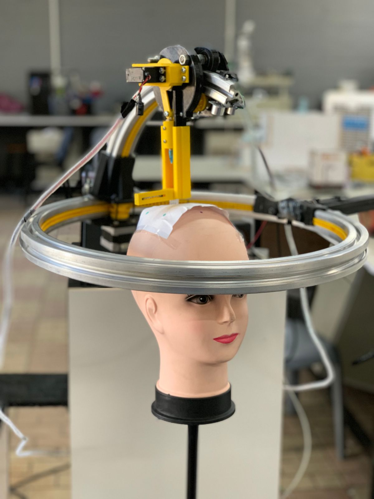

### 🎓 Graduation Project: Auto HairImplant  

**Auto HairImplant** is a **CNC-based hair implantation prototype** developed as a graduation project.  
This system demonstrates a **conceptual automated hair implantation process** using robotics and computer vision.  

🔹 **How ​​it works:**
1. The Raspberry Pi camera captures an image of the scalp and displays it on a screen for the doctor.
2. The doctor draws the desired transplant location on the image.
3. The program creates points representing hair follicles and converts them to coordinates.
4. The coordinates are sent to the Arduino, which controls the motors to move to each point.
5. It includes emergency safety mechanisms for protection.

## 📂 Project Documentation  
You can view the full documentation and presentation here:  
👉 [Google Drive Link] 🔗(https://drive.google.com/drive/folders/1X6iJIoF-ceGvK7QEm4S-ll9425GFcySb?usp=drive_link)  

